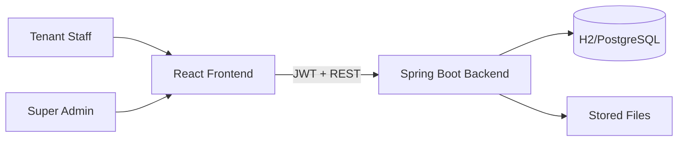
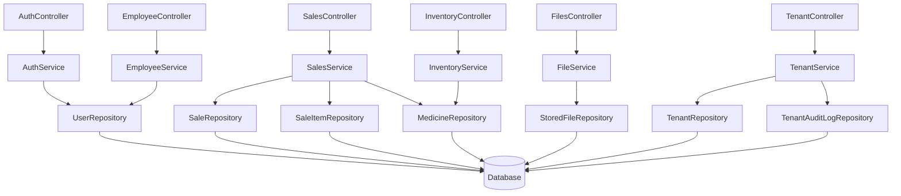
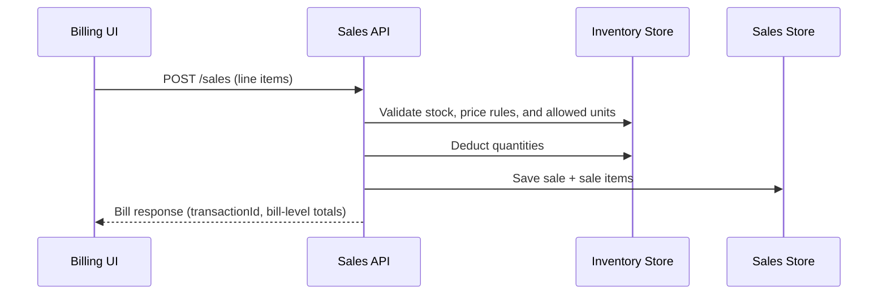

# Pharmacy Management System

A full-stack Pharmacy Management System focused on safe dispensing workflows, inventory control, role-based access, and transaction traceability.

## Project Overview

This repository is a monorepo with:
- `backend/` - Spring Boot (Java 17, Gradle), JWT auth, RBAC, tenant-aware APIs
- `frontend/` - React + Vite UI for operations plus super admin portal
- `docs/` - API and integration documentation artifacts

The system is designed for operational pharmacy workflows:
- Billing with medicine-level rows and usage instructions
- Inventory tracking with cost/selling/profit visibility
- Transaction history with search and detail retrieval
- Role-based module access and admin-managed users
- Multi-tenant onboarding and centralized super admin controls

## Features and Modules

- **Auth & RBAC**
  - Staff login format: `username@tenant`
  - Super admin login: `super_admin` (no tenant)
  - Multi-role authorization (`SUPER_ADMIN`, `ADMIN`, `BILLING`, `TRANSACTIONS`, `INVENTORY`)
  - Dynamic frontend navigation by role and tenant feature toggles
- **Admin Portal (Super Admin)**
  - Tenant create/enable-disable/configure at `/admin-portal/tenants`
  - Tenant module flags: billing, transactions, inventory, analytics, AI assistant
  - Tenant audit listing (`/admin-portal/tenants/audits`)
- **Billing**
  - Row-based medicine entry
  - Final bill-level discount (`discountAmount`)
  - Unit selection constrained by inventory-configured `allowedUnits`
  - Standardized usage instructions + optional custom
  - Usage instructions persisted per line and shown in transaction details
  - Automatic inventory deduction and persisted transactions
- **Inventory**
  - CRUD for medicines
  - Unit type + `allowedUnits`, cost price, selling price, quantity
  - Derived profit per unit (UI)
  - Low-stock and expiry alerts
  - Alerts summary endpoint: `GET /inventory/alerts/summary`
  - Stable API responses (tenant lazy-proxy serialization fix)
- **Transactions & Analytics**
  - Search by ID/date/salesperson
  - Full bill retrieval by transaction ID
  - Sales summary + top medicines + sales by user
- **Users (Admin)**
  - Create/update/delete users
  - Assign multiple roles per user
  - Enable/disable users
  - Gender input standardized to `MALE` or `FEMALE` on create flows

## System Architecture

The project follows a layered architecture with clear boundaries:
- **Presentation Layer**: REST controllers (backend) and pages/components (frontend)
- **Business Layer**: services for auth, employee management, sales, inventory rules
- **Data Layer**: JPA entities + repositories

### High-Level System Diagram



### Backend Component Diagram



### Billing Data Flow Diagram



## Folder Structure

```text
pharmacy-inventory/
  backend/
    src/main/java/lk/pharmacy/inventory/
      auth/ employee/ inventory/ sales/ files/ ai/ security/ exception/
    src/main/resources/
  frontend/
    src/
      pages/ auth/ components/ api.js styles.css
  docs/
    api.md
  plan.md
  README.md
```

## Setup and Run

### Prerequisites
- Java 17+
- Gradle
- Node.js 18+
- Docker Desktop (for containerized local runtime)

### Backend

```powershell
Set-Location "C:\Users\kasun\OneDrive\Desktop\Projects\pharmacy-inventory\backend"
..\gradlew.bat :backend:bootRun
```

Backend default URL: `http://localhost:8080`

Run backend without demo data (schema + base seed only):

```powershell
Set-Location "C:\Users\kasun\OneDrive\Desktop\Projects\pharmacy-inventory"
.\gradlew.bat "-Dapp.demo-data.enabled=false" :backend:bootRun
```

### Frontend

```powershell
Set-Location "C:\Users\kasun\OneDrive\Desktop\Projects\pharmacy-inventory\frontend"
npm install
npm run dev
```

Frontend default URL: `http://localhost:5173`

## Containerized Local Development

This repository includes production-style containerization with separate services for frontend, backend, and PostgreSQL.

### One-command startup

```powershell
Set-Location "C:\Users\kasun\OneDrive\Desktop\Projects\pharmacy-inventory"
Copy-Item .env.example .env
docker compose up -d --build
```

### Verify services

```powershell
docker compose ps
docker compose logs -f backend
```

Endpoints:
- Frontend: `http://localhost:5173`
- Backend API: `http://localhost:8080`
- Backend health: `http://localhost:8080/actuator/health`

### Stop stack

```powershell
docker compose down
```

## Build and Quality Gates

Backend Gradle pipelines now support:
- clean build
- unit tests
- integration tests (`*IntegrationTest`)
- code quality checks (Checkstyle reports)
- test coverage report (JaCoCo)

Run full backend verification:

```powershell
Set-Location "C:\Users\kasun\OneDrive\Desktop\Projects\pharmacy-inventory"
.\gradlew.bat :backend:clean :backend:test :backend:integrationTest :backend:check
```

## CI/CD

- GitHub Actions workflow: `.github/workflows/ci.yml`
  - triggers on push + pull requests to `main`/`master`
  - runs backend checks, frontend build, and Docker image builds
- Jenkins pipeline: `Jenkinsfile`
  - checkout, Gradle build/test/integration, frontend build, Docker build
  - optional Docker registry push using Jenkins credentials (`docker-registry-creds`)

## Security and Production Hardening

- No secrets are committed; use `.env`/CI secret stores.
- Backend secrets and runtime config are environment-driven (`application.yml` placeholders).
- Containers run as non-root users in runtime images.
- Health checks are enabled for backend/frontend/postgres in `docker-compose.yml`.
- CVE mitigation applied: PostgreSQL JDBC driver pinned to `42.7.7`.
- Add image scanning in CI/Jenkins (Trivy stage already included in `Jenkinsfile`).

## Environment Configuration

### Backend (`backend/src/main/resources/application.yml`)
- H2 in-memory by default
- PostgreSQL profile available (`spring.profiles.active=postgres`)
- Flyway manages schema/data migrations (`db/migration` + optional `db/demo`)
- Demo seed toggle: `app.demo-data.enabled=true|false`
- JWT secret/expiration in `app.jwt.*`
- CORS origin in `app.cors.allowed-origin`

### Frontend (`frontend/.env` optional)

```env
VITE_API_BASE_URL=http://localhost:8080
```

## API Documentation

- Human-readable API overview: `docs/api.md`
- Postman collection: `docs/postman/pharmacy-management.postman_collection.json`

## Guidelines for Adding New Features

1. Add/extend DTOs first (request/response contracts).
2. Implement business logic in service layer (not controller).
3. Keep controllers thin: validation + delegation + response mapping.
4. Add/extend repository queries only when required by service logic.
5. Update frontend `api.js` client methods and guarded routes.
6. Add/update tests for service behavior and validation paths.
7. Update `README.md`, `docs/api.md`, and `plan.md` when contracts change.

## Best Practices Applied

- Layered architecture with service-oriented business logic
- Role-based access control with multi-role assignments
- Consistent API error shape via global exception handling
- DTO-based API contracts
- Transactional write workflows for inventory/sales consistency
- Clear UI module separation and route protection
- Tenant-aware auth token model (`tenantId` nullable for super admin)
- Structured operational error payloads (status/error/message/path/timestamp)

## Default Seed Credentials

When `app.demo-data.enabled=true`:

- Tenant staff/admin: `admin@demo` / `admin@123`
- Super admin: `super_admin` / `admin@123`

Demo tenant seed includes:
- Tenant: `DEMO`
- Pharmacies: `Demo Pharmacy P/L Badulla` and `Demo HaliEla Medicine`
- Isolated inventory samples with different stock levels per pharmacy

> Change default credentials before production use.
