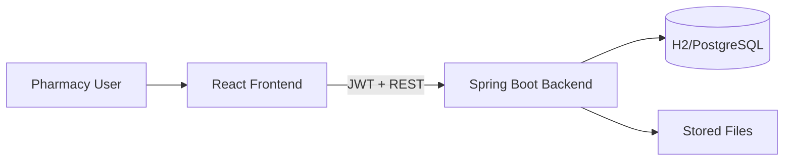
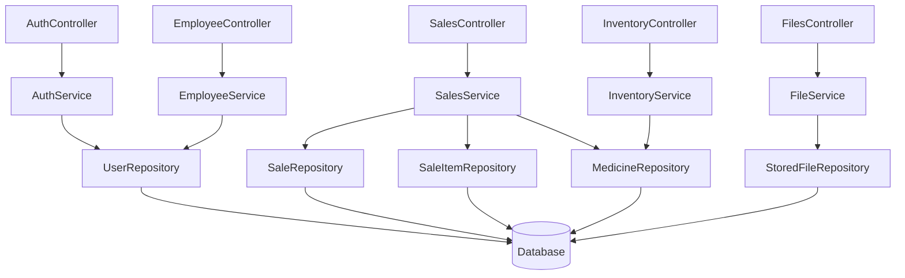
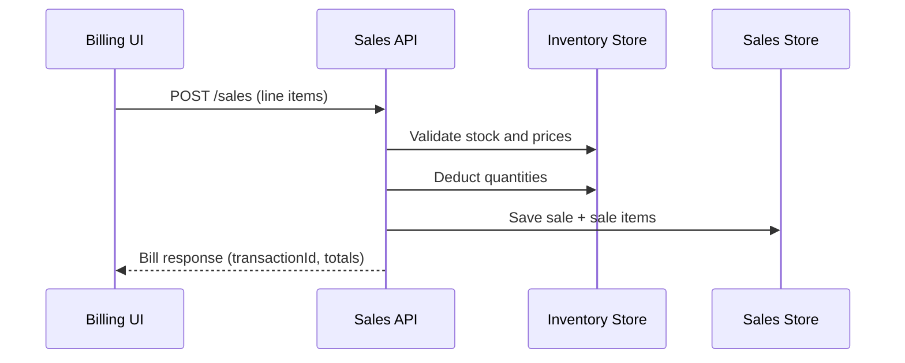

# Pharmacy Management System

A full-stack Pharmacy Management System focused on safe dispensing workflows, inventory control, role-based access, and transaction traceability.

## Project Overview

This repository is a monorepo with:
- `backend/` - Spring Boot (Java 17, Gradle), JWT auth, RBAC, inventory/sales/users APIs
- `frontend/` - React + Vite UI for billing, inventory, transactions, analytics, and user management
- `docs/` - API and integration documentation artifacts

The system is designed for operational pharmacy workflows:
- Billing with medicine-level rows and usage instructions
- Inventory tracking with cost/selling/profit visibility
- Transaction history with search and detail retrieval
- Role-based module access and admin-managed users

## Features and Modules

- **Auth & RBAC**
  - JWT login
  - Multi-role authorization (`ADMIN`, `BILLING`, `TRANSACTIONS`, `INVENTORY`)
  - Dynamic frontend navigation by permissions
- **Billing**
  - Row-based medicine entry
  - Per-line discount (`%` or fixed amount)
  - Standardized usage instructions + optional custom
  - Automatic inventory deduction and persisted transactions
- **Inventory**
  - CRUD for medicines
  - Unit type, cost price, selling price, quantity
  - Derived profit per unit (UI)
  - Low-stock and expiry alerts
- **Transactions & Analytics**
  - Search by ID/date/salesperson
  - Full bill retrieval by transaction ID
  - Sales summary + top medicines + sales by user
- **Users (Admin)**
  - Create/update/delete users
  - Assign multiple roles per user
  - Enable/disable users

## System Architecture

The project follows a layered architecture with clear boundaries:
- **Presentation Layer**: REST controllers (backend) and pages/components (frontend)
- **Business Layer**: services for auth, employee management, sales, inventory rules
- **Data Layer**: JPA entities + repositories

### High-Level System Diagram



### Backend Component Diagram



### Billing Data Flow Diagram



## Folder Structure

```text
pharmacy-inventory/
  backend/
    src/main/java/lk/pharmacy/inventory/
      auth/ employee/ inventory/ sales/ files/ ai/ security/ exception/
    src/main/resources/
  frontend/
    src/
      pages/ auth/ components/ api.js styles.css
  docs/
    api.md
  planning.md
  README.md
```

## Setup and Run

### Prerequisites
- Java 17+
- Gradle
- Node.js 18+

### Backend

```powershell
Set-Location "C:\Users\kasun\OneDrive\Desktop\Projects\pharmacy-inventory\backend"
gradle bootRun
```

Backend default URL: `http://localhost:8080`

### Frontend

```powershell
Set-Location "C:\Users\kasun\OneDrive\Desktop\Projects\pharmacy-inventory\frontend"
npm install
npm run dev
```

Frontend default URL: `http://localhost:5173`

## Environment Configuration

### Backend (`backend/src/main/resources/application.yml`)
- H2 in-memory by default
- PostgreSQL profile available (`spring.profiles.active=postgres`)
- JWT secret/expiration in `app.jwt.*`
- CORS origin in `app.cors.allowed-origin`

### Frontend (`frontend/.env` optional)

```env
VITE_API_BASE_URL=http://localhost:8080
```

## API Documentation

- Human-readable API overview: `docs/api.md`
- Postman collection: `docs/postman/pharmacy-management.postman_collection.json`

## Guidelines for Adding New Features

1. Add/extend DTOs first (request/response contracts).
2. Implement business logic in service layer (not controller).
3. Keep controllers thin: validation + delegation + response mapping.
4. Add/extend repository queries only when required by service logic.
5. Update frontend `api.js` client methods and guarded routes.
6. Add/update tests for service behavior and validation paths.
7. Update `README.md`, `docs/api.md`, and `planning.md` when contracts change.

## Best Practices Applied

- Layered architecture with service-oriented business logic
- Role-based access control with multi-role assignments
- Consistent API error shape via global exception handling
- DTO-based API contracts
- Transactional write workflows for inventory/sales consistency
- Clear UI module separation and route protection

## Default Seed Credentials

- Username: `admin`
- Password: `admin123`

> Change default credentials before production use.
